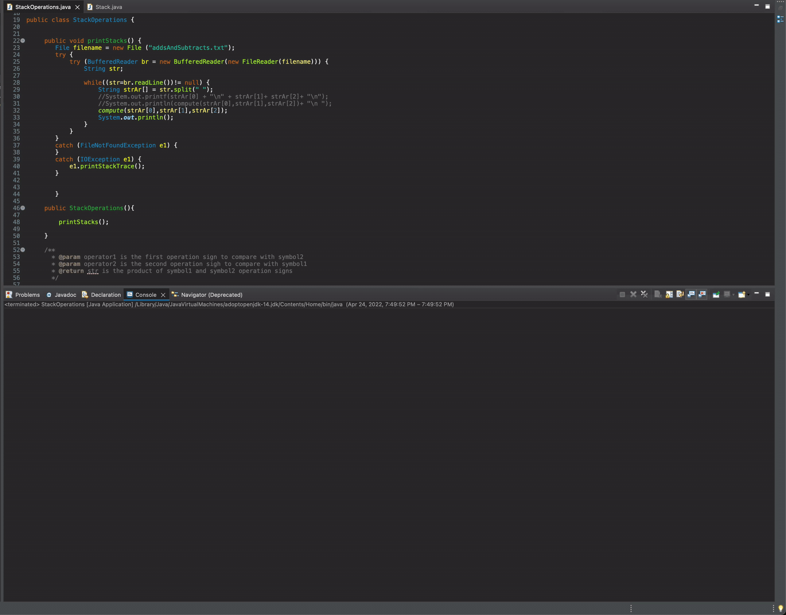

# Adding-and-Subtracting-Numbers-Using-Stacks

Develop a java program that computes large expressions with two operands using stacks.
The program will read a text file, then process the computations using two stacks for the operands and one for the results.
The program will display each expression to be evaluate and the arithmetic result. 

